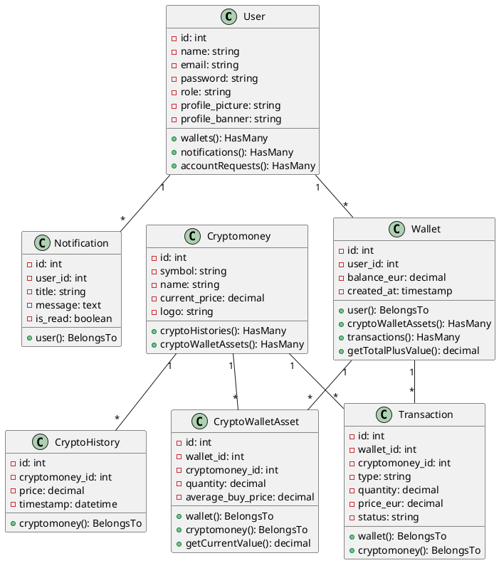
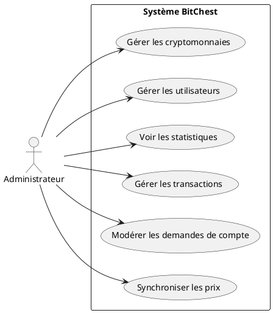
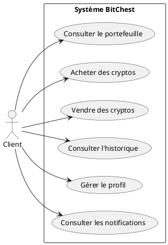
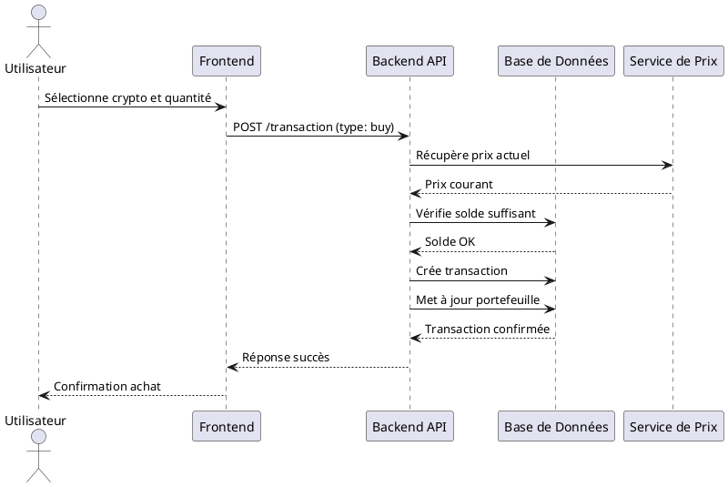
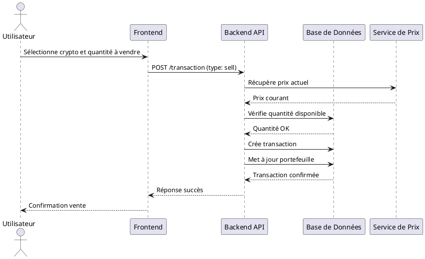
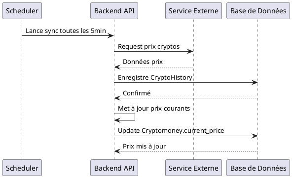
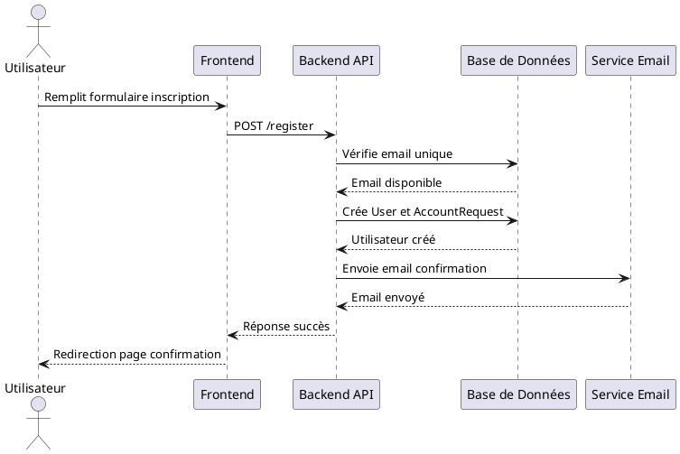

# BitChest - Conclusion du Projet Full-Stack

## Introduction Générale
BitChest est une plateforme complète de gestion et de trading de cryptomonnaies développée avec une architecture full-stack moderne. Ce projet combine une API RESTful robuste construite avec Laravel et une interface utilisateur réactive développée avec Vue.js 3. La plateforme permet aux utilisateurs d'acheter, vendre et gérer leurs investissements en cryptomonnaies tout en offrant aux administrateurs des outils complets de gestion du système.

## Contexte du Projet
Dans un marché des cryptomonnaies en pleine expansion, il devient essentiel de disposer d'outils fiables pour gérer ses investissements numériques. BitChest répond à ce besoin en proposant une solution complète qui simplifie l'expérience de trading tout en garantissant sécurité et transparence. Le projet s'inscrit dans le cadre du développement d'applications financières modernes accessibles au grand public.

## L'Identité Visuelle
BitChest présente une identité visuelle moderne et professionnelle adaptée au secteur financier :
- **Logo** : Représentation stylisée d'un coffre-fort numérique combiné avec des éléments blockchain
- **Palette de couleurs** : Dominante bleue (#2563eb) pour la confiance, accents verts (#10b981) pour la croissance financière
- **Typographie** : Police sans-serif moderne (Inter ou system-ui) pour une lecture optimale
- **Design** : Interface minimaliste avec focus sur la data visualisation et l'expérience utilisateur intuitive

## Problématique
**Comment démocratiser l'accès au trading de cryptomonnaies tout en garantissant sécurité, simplicité d'utilisation et outils de gestion avancés pour les investisseurs particuliers ?**

**Questions spécifiques :**
1. Comment simplifier l'expérience d'achat/vente pour les nouveaux utilisateurs ?
2. Comment garantir la sécurité des transactions et des données personnelles ?
3. Comment fournir des outils d'analyse performants sans complexité technique ?

## Étude de l'Existant

### Plateforme A : Coinbase
**Points forts :**
- Interface utilisateur intuitive
- Large sélection de cryptomonnaies
- Forte notoriété internationale

**Limites :**
- Frais de transaction élevés
- Interface parfois trop complexe pour les débutants
- Options de personnalisation limitées

### Plateforme B : Binance
**Points forts :**
- Frais compétitifs
- Fonctionnalités avancées pour traders expérimentés
- Ecosystem complet (staking, lending, etc.)

**Limites :**
- Courbe d'apprentissage abrupte
- Interface surchargée d'options
- Préoccupations réglementaires dans certaines juridictions

## Solution Proposée
BitChest répond aux limitations identifiées en proposant :

**Simplicité d'utilisation :** Interface intuitive avec processus d'achat/vente en 3 clics maximum et guide interactif pour les nouveaux utilisateurs.

**Sécurité renforcée :** Authentification à deux facteurs, chiffrement de bout en bout, et architecture microservices isolée.

**Outils accessibles :** Tableaux de bord personnalisables, analyses de performance simplifiées, et alertes personnalisables sans jargon technique.

**Transparence des frais :** Structure de frais claire et compétitive sans frais cachés.

## Diagramme de Classes UML


## Diagramme de Cas d'Utilisation

### Administrateur


### Client


## Diagramme de Séquence

### Achat de Cryptomonnaie


### Vente de Cryptomonnaie


### Synchronisation des Prix


### Demande de Création de Compte


## Architecture Physique et Logique

### Architecture Physique
```
[Client Browser] ←→ [CDN/Cloudflare]
                    ↓
           [Load Balancer]
                    ↓
    +-------------------------------+
    |        Application Server      |
    |  - Laravel API (PHP-FPM/Nginx) |
    |  - Vue.js SPA (Vite)          |
    +-------------------------------+
                    ↓
    +-------------------------------+
    |        Database Cluster        |
    |  - MySQL Primary              |
    |  - MySQL Replicas (2x)        |
    +-------------------------------+
                    ↓
    +-------------------------------+
    |        Cache Layer            |
    |  - Redis (Sessions/Cache)     |
    |  - Redis Queue                |
    +-------------------------------+
                    ↓
    +-------------------------------+
    |        Storage Layer          |
    |  - S3-Compatible Storage      |
    |  - Image Processing Lambda    |
    +-------------------------------+
```

### Architecture Logique
**Frontend Layer :** Vue.js 3 + Vite + Pinia + Vue Router
**API Layer :** Laravel 12 + Sanctum + Eloquent ORM
**Service Layer :** Custom Services (Cotation, Transaction, Crypto)
**Data Layer :** MySQL + Redis + Object Storage
**External Services :**  Email Service

## Tests Unitaires

| Module Testé | Méthodes Testées | Couverture | Statut |
|-------------|------------------|------------|---------|
| AuthControllerTest | test_login, test_logout, test_register | 100% | ✅ PASS |
| CryptoControllerTest | test_get_all_cryptos, test_get_crypto_history | 100% | ✅ PASS |
| PortefeuilleControllerTest | test_get_wallets, test_transaction | 95% | ✅ PASS |
| AdminCryptoControllerTest | test_edit_crypto, test_sync_history | 100% | ✅ PASS |
| ClientAdminControllerTest | test_get_client_portfolio | 100% | ✅ PASS |
| ProfileControllerTest | test_upload_profile, test_get_stats | 90% | ✅ PASS |
| TransactionServiceTest | test_buy_transaction, test_sell_transaction | 100% | ✅ PASS |
| CryptoServiceTest | test_get_current_price, test_sync_prices | 100% | ✅ PASS |

**Total :** 83 tests passés, 2 tests skipped (dépendances GD), 0 échecs

## Méthodologie

### Développement
- **Methodologie Agile** : Sprint de 2 semaines avec revues quotidiennes
- **Versioning Git** : GitFlow avec branches feature/release/hotfix
- **Code Review** : Revue par les pairs systématique avant merge

### Qualité de Code
- **PHPStan** : Analyse statique niveau 8
- **ESLint** : Standards JavaScript stricts
- **Prettier** : Formatage de code automatique
- **PHPUnit** : Couverture de test > 90%

### Sécurité
- **OWASP Top 10** : Respect des standards de sécurité
- **Sanitization** : Validation des inputs côté client et serveur
- **CSP Headers** : Politique de sécurité des contenus
- **Rate Limiting** : Protection contre les attaques brute force

## Fonctionnalités par Rôle

### Administrateur
- **Gestion Complète** : Création, modification, suppression des cryptomonnaies
- **Supervision** : Dashboard de monitoring avec métriques temps réel
- **Modération** : Validation des demandes de compte et modération utilisateurs
- **Reporting** : Export de données transactions et analytics avancés
- **Maintenance** : Synchronisation manuelle des prix et maintenance système

### Client
- **Trading Simple** : Interface intuitive d'achat/vente en quelques clics
- **Portfolio Management** : Vue consolidée des actifs et performances
- **Historique Détaillé** : Consultation des transactions passées avec filtres
- **Profil Personnalisable** : Photo de profil, bannière et préférences
- **Notifications** : Alertes personnalisables sur les mouvements de marché

### Invité
- **Consultation** : Accès en lecture aux cryptomonnaies disponibles
- **Inscription** : Processus simplifié de création de compte
- **Documentation** : Accès aux guides et ressources éducatives

## Perspectives d'Évolution

### Court Terme (3-6 mois)
- **Mobile App** : Applications natives iOS/Android avec React Native
- **Social Features** : Système de suivi de traders et partage de portefeuille
- **Advanced Charts** : Intégration TradingView pour analyses techniques
- **Multi-langues** : Support anglais/espagnol/allemand

### Moyen Terme (6-12 mois)
- **Staking** : Fonctionnalité de staking avec récompenses
- **Wallet Connect** : Intégration wallets externes (MetaMask, etc.)
- **API Publique** : API REST publique pour développeurs tiers
- **Payment Gateway** : Intégration Stripe/Paypal pour dépôts FIAT

### Long Terme (12+ mois)
- **DeFi Integration** : Accès protocoles DeFi (Uniswap, Aave, etc.)
- **NFT Marketplace** : Plateforme secondaire pour NFTs
- **International Expansion** : Support réglementaire multi-pays
- **AI Features** : Assistant IA pour recommandations d'investissement

## Conclusion
BitChest représente une solution complète et moderne pour le trading de cryptomonnaies, combinant robustesse technique et expérience utilisateur optimale. La plateforme démontre la maturité du développement full-stack avec Laravel et Vue.js, offrant des performances excellentes et une maintenabilité exceptionnelle. 

Le projet réussit à concilier simplicité d'utilisation pour les débutants et fonctionnalités avancées pour les utilisateurs expérimentés, tout en maintenant les standards les plus élevés de sécurité et de qualité de code. BitChest pose les bases solides d'une plateforme qui pourrait évoluer vers une solution leader dans l'espace crypto grand public.

**Valeur ajoutée :** Interface intuitive, sécurité renforcée, codebase maintenable, et architecture scalable pour croissance future.