# DIAGRAMME DE CLASSES - BITCHEST PLATFORM

## Vue d'ensemble
Ce diagramme de classes représente l'architecture complète du backend BitChest basée sur les modèles Laravel et migrations.

```mermaid
classDiagram
    class User {
        -id: string
        -name: string
        -email: string
        -email_verified_at: datetime
        -password: string
        -role: string
        -remember_token: string
        -created_at: datetime
        -updated_at: datetime
        +wallets(): HasMany
        +wallet(): HasOne
        +notifications(): HasMany
        +accountRequest(): HasOne
        +boot(): void
    }

    class Wallet {
        -id: string
        -user_id: string
        -balance_eur: decimal(10,2)
        -created_at: datetime
        -updated_at: datetime
        +user(): BelongsTo
        +cryptoWalletAssets(): HasMany
        +transactions(): HasManyThrough
        +getTotalValue(): float
        +getTotalPlusValue(): float
        +boot(): void
    }

    class Cryptomoney {
        -id: string
        -name: string
        -symbol: string
        -coingecko_id: string
        -image: string
        -category: string
        -website: string
        -price_eur: decimal(20,8)
        -market_cap: decimal(20,8)
        -volume_24h: decimal(20,8)
        -change_24h_pct: decimal(8,8)
        -updated_at_api: datetime
        -created_at: datetime
        -updated_at: datetime
        +cryptoWalletAssets(): HasMany
        +histories(): HasMany
        +getPriceAttribute(): decimal
        +getChange24hAttribute(): decimal
        +getImageUrlAttribute(): string
        +setImageAttribute($value): void
        +boot(): void
        +toArray(): array
    }

    class CryptoWalletAsset {
        -id: string
        -wallet_id: string
        -cryptomoney_id: string
        -quantity: decimal(20,8)
        -average_buy_price: decimal(20,8)
        -created_at: datetime
        -updated_at: datetime
        +wallet(): BelongsTo
        +cryptomoney(): BelongsTo
        +transactions(): HasMany
        +getTotalInvested(): float
        +getCurrentValue(): float
        +getPlusValue(): float
        +boot(): void
    }

    class Transaction {
        -id: string
        -crypto_wallet_asset_id: string
        -cryptomoney_id: string
        -type: string
        -quantity: decimal(20,8)
        -price: decimal(20,8)
        -total_eur: decimal(20,8)
        -admin_operation: boolean
        -cancelled_at: datetime
        -cancel_reason: string
        -created_at: datetime
        -updated_at: datetime
        +cryptoWalletAsset(): BelongsTo
        +cryptomoney(): BelongsTo
        +getWalletAttribute(): Wallet
        +boot(): void
    }

    class Notification {
        -id: string
        -user_id: string
        -title: string
        -message: text
        -type: string
        -is_read: boolean
        -created_at: datetime
        -updated_at: datetime
        +TYPE_ACCOUNT_REQUEST: const
        +TYPE_TRANSACTION: const
        +TYPE_PRICE_UPDATE: const
        +TYPE_ADMIN_ACTION: const
        +user(): BelongsTo
        +icon(): string
        +color(): string
        +shouldSendEmail(): boolean
        +boot(): void
    }

    class AccountRequest {
        -id: string
        -name: string
        -email: string
        -status: string
        -token: string
        -processed_at: datetime
        -processed_by: string
        -user_id: string
        -rejection_reason: text
        -created_at: datetime
        -updated_at: datetime
        +user(): BelongsTo
        +processedBy(): BelongsTo
        +boot(): void
    }

    class CryptoHistory {
        -id: string
        -cryptomoney_id: string
        -price: decimal(20,8)
        -market_cap: decimal(20,8)
        -volume: decimal(20,8)
        -recorded_at: datetime
        -created_at: datetime
        -updated_at: datetime
        +cryptomoney(): BelongsTo
        +boot(): void
    }

    %% Relations principales
    User "1" --> "0..*" Wallet : hasMany
    User "1" --> "1" Wallet : hasOne
    User "1" --> "0..*" Notification : hasMany
    User "1" --> "0..1" AccountRequest : hasOne
    User "1" --> "0..*" AccountRequest : processedBy
    
    Wallet "1" --> "1" User : belongsTo
    Wallet "1" --> "0..*" CryptoWalletAsset : hasMany
    Wallet "1" --> "0..*" Transaction : hasManyThrough
    
    Cryptomoney "1" --> "0..*" CryptoWalletAsset : hasMany
    Cryptomoney "1" --> "0..*" CryptoHistory : hasMany
    
    CryptoWalletAsset "0..*" --> "1" Wallet : belongsTo
    CryptoWalletAsset "0..*" --> "1" Cryptomoney : belongsTo
    CryptoWalletAsset "1" --> "0..*" Transaction : hasMany
    
    Transaction "0..*" --> "1" CryptoWalletAsset : belongsTo
    Transaction "0..*" --> "1" Cryptomoney : belongsTo
    
    Notification "0..*" --> "0..1" User : belongsTo
    AccountRequest "0..1" --> "1" User : belongsTo
    AccountRequest "0..*" --> "1" User : processedBy
    
    CryptoHistory "0..*" --> "1" Cryptomoney : belongsTo
```

## Détails des Relations

### Relations One-to-Many (1:N)

#### User → Wallet (1:1)
- **User** possède un **Wallet** principal (`hasOne`)
- **Wallet** appartient à un **User** (`belongsTo`)

#### User → Wallet (1:N)
- **User** peut avoir plusieurs **Wallet** (`hasMany`)
- **Wallet** appartient à un **User** (`belongsTo`)

#### User → Notification (1:N)
- **User** a plusieurs **Notification** (`hasMany`)
- **Notification** appartient à un **User** (`belongsTo`)

#### User → AccountRequest (1:1)
- **User** a une **AccountRequest** (`hasOne`)
- **AccountRequest** appartient à un **User** (`belongsTo`)

#### Cryptomoney → CryptoWalletAsset (1:N)
- **Cryptomoney** peut être dans plusieurs **CryptoWalletAsset** (`hasMany`)
- **CryptoWalletAsset** appartient à une **Cryptomoney** (`belongsTo`)

#### Wallet → CryptoWalletAsset (1:N)
- **Wallet** contient plusieurs **CryptoWalletAsset** (`hasMany`)
- **CryptoWalletAsset** appartient à un **Wallet** (`belongsTo`)

#### CryptoWalletAsset → Transaction (1:N)
- **CryptoWalletAsset** a plusieurs **Transaction** (`hasMany`)
- **Transaction** appartient à un **CryptoWalletAsset** (`belongsTo`)

#### Cryptomoney → CryptoHistory (1:N)
- **Cryptomoney** a un historique de prix **CryptoHistory** (`hasMany`)
- **CryptoHistory** appartient à une **Cryptomoney** (`belongsTo`)

### Relations Many-to-One (N:1)

#### AccountRequest → User (N:1)
- **AccountRequest** est traitée par un **User** (admin) (`processedBy`)
- **User** peut traiter plusieurs **AccountRequest** (`hasMany`)

### Relations Many-to-Many Through (N:M)

#### Wallet → Transaction (N:M via CryptoWalletAsset)
- **Wallet** accède aux **Transaction** via **CryptoWalletAsset** (`hasManyThrough`)

## Méthodes Clés par Classe

### User
- **Relations** : wallets(), wallet(), notifications(), accountRequest()
- **Boot** : Génération automatique d'ID et remember_token

### Wallet
- **Relations** : user(), cryptoWalletAssets(), transactions()
- **Méthodes métier** : getTotalValue(), getTotalPlusValue()
- **Boot** : Génération automatique d'ID

### Cryptomoney
- **Relations** : cryptoWalletAssets(), histories()
- **Accessors** : getPriceAttribute(), getChange24hAttribute(), getImageUrlAttribute()
- **Mutators** : setImageAttribute()
- **Boot** : Génération automatique d'ID

### CryptoWalletAsset
- **Relations** : wallet(), cryptomoney(), transactions()
- **Méthodes métier** : getTotalInvested(), getCurrentValue(), getPlusValue()
- **Boot** : Génération automatique d'ID

### Transaction
- **Relations** : cryptoWalletAsset(), cryptomoney()
- **Accessors** : getWalletAttribute()
- **Boot** : Génération automatique d'ID

### Notification
- **Relations** : user()
- **Méthodes utilitaires** : icon(), color(), shouldSendEmail()
- **Constantes** : TYPE_ACCOUNT_REQUEST, TYPE_TRANSACTION, TYPE_PRICE_UPDATE, TYPE_ADMIN_ACTION
- **Boot** : Génération automatique d'ID

### AccountRequest
- **Relations** : user(), processedBy()
- **Boot** : Génération automatique d'ID et token

### CryptoHistory
- **Relations** : cryptomoney()
- **Boot** : Génération automatique d'ID

## Contraintes et Règles Métier

### Contraintes de Base de Données
- Tous les ID sont des strings générés automatiquement (14 caractères)
- Les prix utilisent des décimales avec 8 décimales pour la précision crypto
- Les timestamps sont automatiquement gérés par Laravel

### Règles Métier
- Un **User** ne peut avoir qu'un **Wallet** principal (relation hasOne)
- Les **Transaction** peuvent être annulées (champ cancelled_at)
- Les **Notification** ont des types prédéfinis avec icônes et couleurs
- Les **AccountRequest** nécessitent un token unique pour l'approbation
- Les **CryptoHistory** enregistrent l'évolution des prix

## Architecture Technique

### Pattern Utilisé
- **Active Record Pattern** via Eloquent ORM
- **Repository Pattern** implicite via les modèles
- **Service Layer** via les Services Laravel

### Caractéristiques Clés
- UUID personnalisés pour tous les modèles
- Relations Eloquent complètes
- Casting automatique des types
- Boot methods pour la logique de création
- Accessors et Mutators pour la transformation des données
- Méthodes métier encapsulées dans les modèles

Ce diagramme représente l'architecture complète et cohérente du système BitChest avec toutes ses relations et méthodes essentielles.