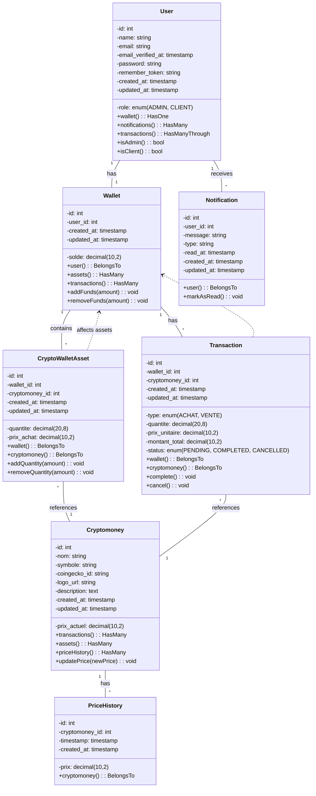
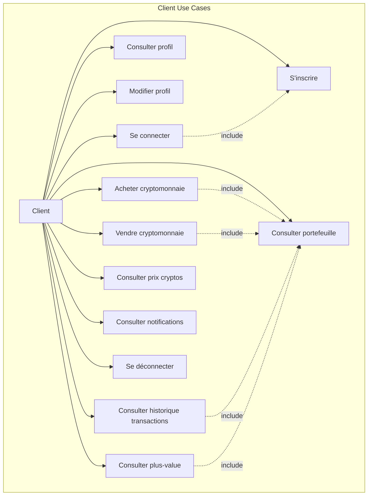
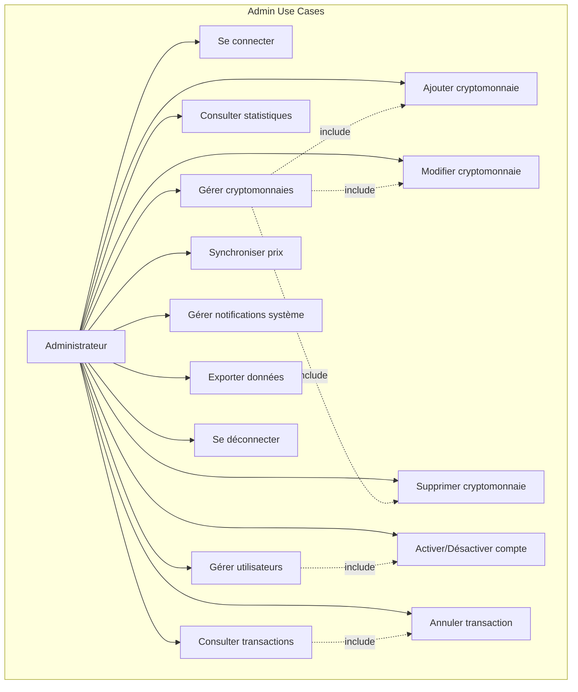
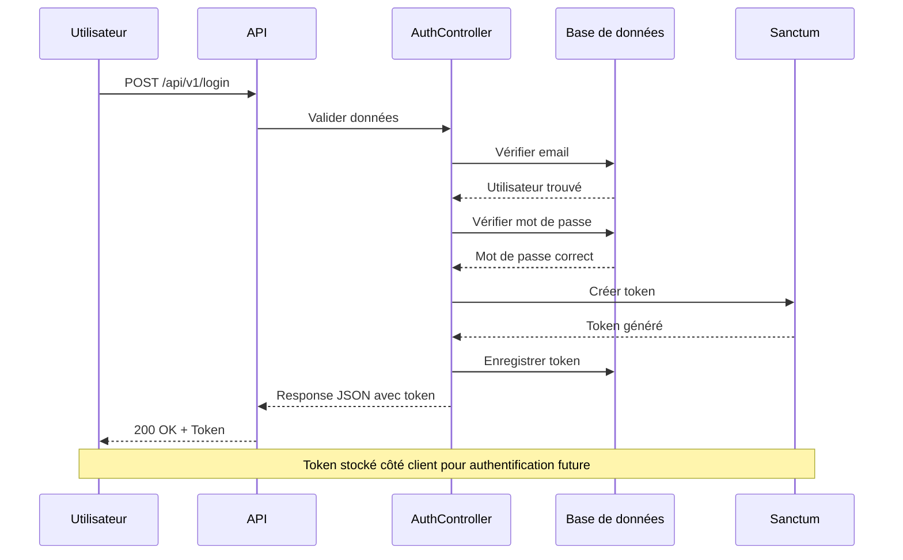
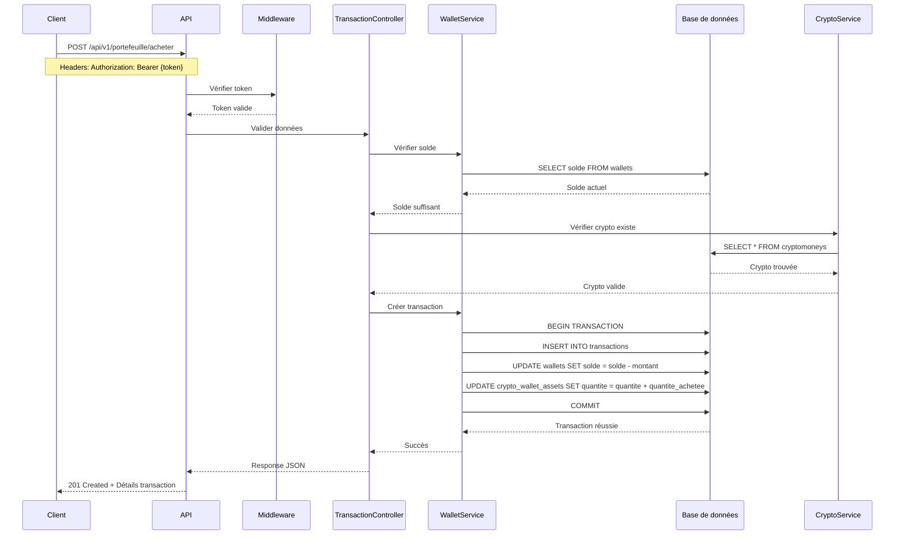
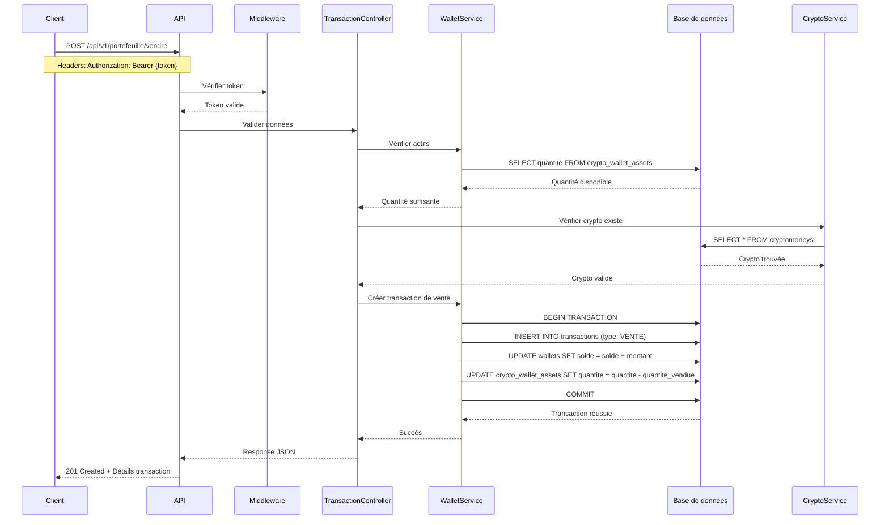
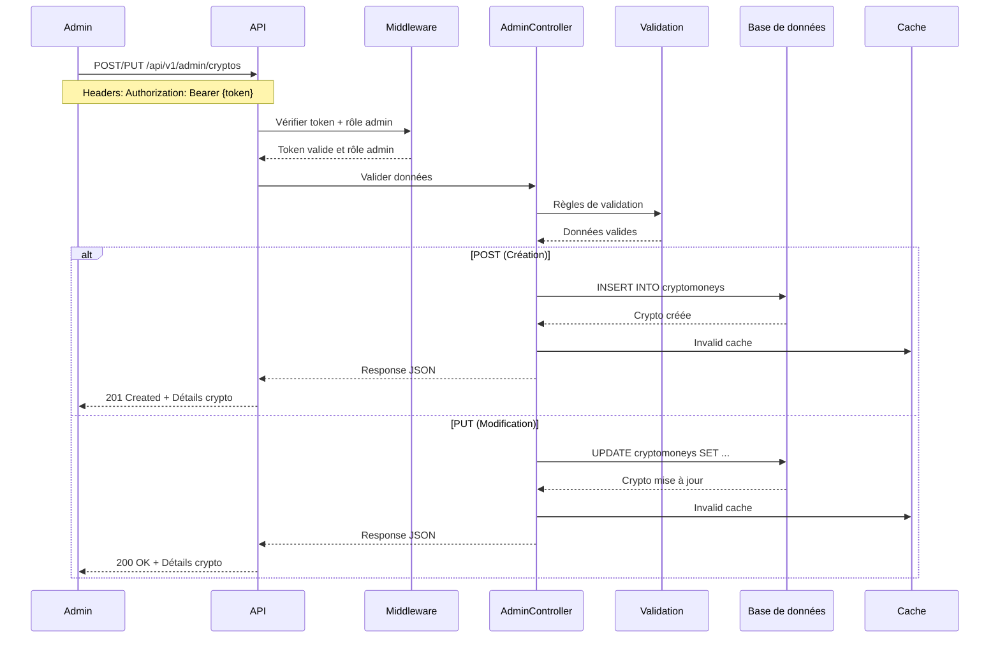

# Document de Conception - Bitchest

## 1. Vue d'Ensemble du Système

Bitchest est une plateforme de gestion de cryptomonnaies qui permet aux utilisateurs d'acheter, vendre et gérer leur portefeuille de cryptomonnaies. Le système est divisé en deux parties principales : une interface client pour les utilisateurs finaux et une interface d'administration pour la gestion du système.

### Objectifs du Système
- Faciliter l'achat et la vente de cryptomonnaies
- Gérer les portefeuilles d'utilisateurs
- Administrer les cryptomonnaies disponibles
- Assurer la sécurité des transactions
- Fournir des statistiques et analyses

## 2. Architecture Technique

### Stack Technique
- **Backend**: Laravel 12.x (PHP 8.2+)
- **Frontend**: Vue.js 3 (Intégration possible)
- **Base de données**: MySQL
- **API**: RESTful avec Laravel Sanctum
- **Authentification**: Token-based (Sanctum)
- **Documentation API**: Swagger/OpenAPI

### Architecture MVC
Le système suit l'architecture MVC (Model-View-Controller) de Laravel :
- **Models**: Représentation des données et logique métier
- **Controllers**: Gestion des requêtes HTTP et réponses
- **Views**: Retour JSON pour l'API

## 3. Diagramme de Classes

## 4. Diagrammes de Cas d'Utilisation

### 4.1 Cas d'Utilisation - Client

### 4.2 Cas d'Utilisation - Administrateur

## 5. Diagrammes de Séquence

### 5.1 Authentification

### 5.2 Achat de Cryptomonnaie

### 5.3 Vente de Cryptomonnaie

### 5.4 Gestion des Cryptomonnaies (Admin - POST/PUT)

## 6. Services et Composants

### 6.1 Services Principaux

#### WalletService
- Gestion du solde du portefeuille
- Vérification des fonds disponibles
- Calcul des plus-values
- Historique des transactions

#### CryptoService
- Synchronisation des prix via CoinGecko API
- Gestion des cryptomonnaies
- Calcul des valeurs actuelles
- Historique des prix

#### TransactionService
- Traitement des achats/ventes
- Validation des transactions
- Gestion des états des transactions
- Notifications de transaction

#### AuthService
- Authentification des utilisateurs
- Gestion des rôles et permissions
- Génération et validation des tokens
- Réinitialisation de mot de passe

### 6.2 Middleware

#### AdminMiddleware
- Vérifie que l'utilisateur est administrateur
- Bloque l'accès aux routes admin pour les clients

#### AuthMiddleware
- Vérifie la validité du token d'authentification
- Ajoute l'utilisateur authentifié à la requête

### 6.3 Jobs et Files d'Attente

#### SyncCryptoPricesJob
- Synchronise les prix des cryptomonnaies
- Exécuté toutes les heures via cron
- Utilise l'API CoinGecko

#### SendNotificationJob
- Envoie les notifications par email
- Gère les notifications en file d'attente

## 7. Sécurité

### 7.1 Authentification
- Tokens JWT via Laravel Sanctum
- Expiration des tokens configurée
- Refresh tokens possibles

### 7.2 Validation des Données
- Validation côté serveur pour toutes les entrées
- Protection contre les injections SQL
- Sanitization des données

### 7.3 Chiffrement
- Mots de passe hashés avec bcrypt
- Communications HTTPS recommandées
- Données sensibles chiffrées

### 7.4 Limitation de Requêtes
- Rate limiting sur les endpoints API
- Protection contre les attaques par force brute
- Limitation par IP et par utilisateur

## 8. Performance

### 8.1 Cache
- Cache Redis pour les prix des cryptos
- Cache des requêtes fréquentes
- Invalidation intelligente du cache

### 8.2 Optimisation Base de Données
- Index sur les colonnes fréquemment recherchées
- Relations eager loading
- Pagination des résultats

### 8.3 Optimisation des Requêtes
- Requêtes optimisées avec Eloquent
- Évitement des requêtes N+1
- Utilisation de collections Laravel

## 9. Tests

### 9.1 Tests Unitaires
- Tests des modèles
- Tests des services
- Tests des helpers

### 9.2 Tests d'Intégration
- Tests des contrôleurs
- Tests des endpoints API
- Tests des middlewares

### 9.3 Tests de Sécurité
- Tests d'authentification
- Tests d'autorisation
- Tests de validation

## 10. Déploiement

### 10.1 Configuration Production
- Variables d'environnement sécurisées
- Base de données optimisée
- Serveur web configuré
- SSL activé

### 10.2 Monitoring
- Logs d'erreurs
- Monitoring des performances
- Alertes en cas de problème
- Backup automatique

## 11. Maintenance

### 11.1 Mises à Jour
- Mise à jour régulière des dépendances
- Patchs de sécurité
- Mise à jour des prix des cryptos

### 11.2 Backup
- Backup quotidien de la base de données
- Backup des fichiers importants
- Tests de restauration réguliers

Ce document de conception est évolutif et doit être mis à jour en fonction des évolutions du système.